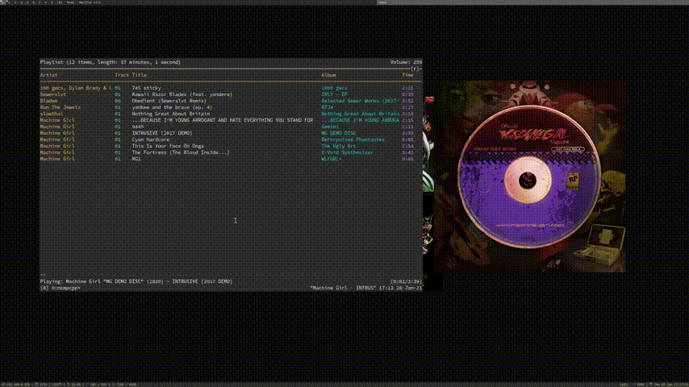

mpdart
======

mpdart is a simple X application that displays the album art of the currently playing mpd song and lets you toggle play pause. It spends almost all of it's time idle and only uses `0.1%` of my RAM and `0.1%` of my CPU according to top.

Depends
-------

	C compiler
	make

	libX11
	libmpdclient
	libim2
	pkg-config # optional build time dependency

Building
--------

	./configure.sh
	make
	make install # supports PREFIX and DESTDIR

Usage
-----

There are four flags:

	mpdart -d musicdir -h host -p port -t timeout # timeout is milliseconds

Though all but -d have default values:

	mpdart -d ~/music

These options can also be configured in the enviorment variables `MPDART_DIR`, `MPDART_HOST`, `MPDART_PORT`, and `MPDART_TIMEOUT`.

To make these changes persistent, export them in your `~/.profile`.

Once mpdart is running you can press the window to toggle mpd's pause/play.

Contributing
------------

### pull requests
If you like github you can contribute by sending in a pull request at
https://github.com/depsterr/mpdart

### patches
If you don't like github you can contribute by emailing me at
depsterr at protonmail dot com with the output of

	git format-patch

after you've commited your changes to your local tree.

Credits
-------

Big thanks to my friend wooosh for helping me debug and develop this :)
